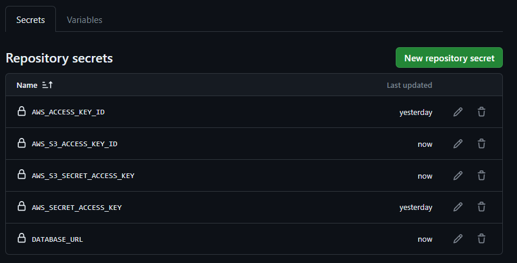
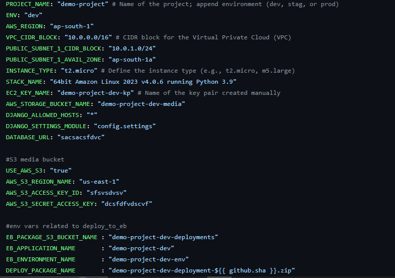

# CD README

## Overview

This repository contains Infrastructure as Code (IaC) for deploying a web application on AWS using Terraform. The deployment process includes provisioning a Virtual Private Cloud (VPC), EC2 instances, and optionally, an Elastic Beanstalk environment. The CI/CD pipeline is set up with GitHub Actions to automate the deployment process.

## Prerequisites

Before running the CI/CD pipeline, make sure to complete the following steps:

1. **Remote State File:**
   - Add the remote state file storing path (S3 folder name) to the `providers.tf` file in the `terraform` folder.
     ```hcl
     terraform {
      backend "s3" {
         bucket = "ixd-terraform-tfstate-bucket"
         key    = "add your key here" #ex: terraform-aws-beanstalk-deployment/terraform.tfstate
         region = "us-east-1"
      }
   }
     ```

2. **S3 Bucket for Media Files:**
   - Manually create an S3 bucket to store media files. The bucket name should be in this format: `<your-project-name+env>-media`. Example: "demo-project-dev-media"

3. **GitHub Secrets:**
   - `AWS_ACCESS_KEY_ID` and `AWS_SECRET_ACCESS_KEY`: Add AWS user access keys with relevant permissions to create infrastructure. These should be added as GitHub Secrets.
   - `AWS_S3_ACCESS_KEY_ID` and `AWS_S3_SECRET_ACCESS_KEY`: Create a user with access to the S3 bucket for media files that created in step 2. Add the user's access key ID and secret access key as GitHub Secrets.
   - `DATABASE_URL`: Create a database and add the database connection string as a GitHub Secret. Example: `postgresql://db_user:<password>@ixd-common-db-server.cycideyygjht.us-east-2.rds.amazonaws.com:5432/<database_name>`


4. **Key Pair:**
   - Manually create an EC2 key pair. The name should be in the format `<your-project-name+env>-kp`. Example: "demo-project-dev-kp"

5. Adjust Terraform variables in the cd.yml according to your project needs. Such as PROJECT_NAME, ENV, AWS_REGION, VPC_CIDR_BLOCK


## GitHub Actions

The repository includes three GitHub Actions workflows:

1. **terraform-build:**
   - This workflow initializes and applies Terraform configurations. It also includes a destroy step to clean up resources.

2. **push_to_s3:**
   - This workflow creates a deployment package (ZIP file) and copies it to the specified S3 bucket for Elastic Beanstalk.

3. **deploy_to_eb:**
   - This workflow configures AWS credentials, creates a new Elastic Beanstalk application version, and deploys the application to the specified environment.

## Usage

1. Push changes to the `master` branch to trigger the CI/CD pipeline.

2. Monitor the progress of each workflow in the GitHub Actions tab.

3. Ensure that secrets and prerequisites are set up correctly for successful execution.

## Note

- The deployment assumes the use of an Amazon Linux 2 AMI running Python 3.9.

- Adjust Terraform variables in the workflows according to your project needs.

- The provided workflows are basic examples and may need customization based on specific project requirements.

**Congratulations on setting up your CI/CD pipeline! 🚀**
